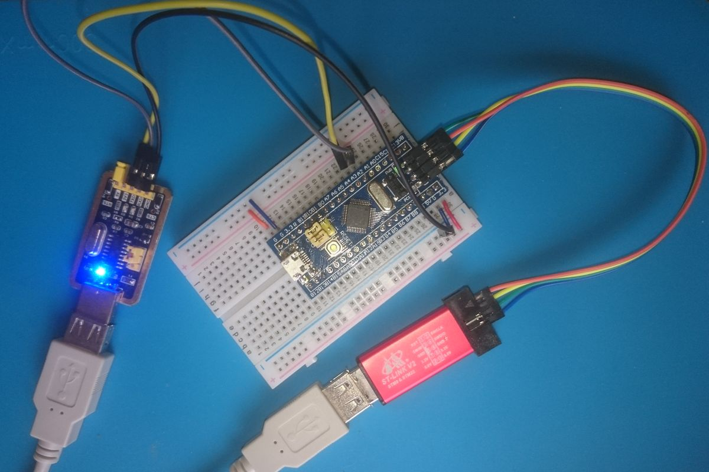

# Example of the Greentea test with Bluepill board with `vznncv-mbed-greentea` tool

## Overview

This project represents example of a board manager script `board_srcipt_manager.sh` for `vznncv-mbed-greentea` tool,
that uses [OpenOCD](http://openocd.org/) and a separate USB adapter.

The example is based on a [MbedOS Bluepill port](https://os.mbed.com/users/hudakz/code/mbed-os-bluepill/)
of Zoltan Hudak and contains simple Greentea test inside `TESTS` directory.

## Hardware configuration

Bluepill is small popular hobby board, that doesn't have embedded debugging/flash interface,
so it usually is used with standalone stlink v2 debugger and USB-UART adapter for communication
with host.

To run tests you need to connect stlink and USB-UART adapter to the board:



UART connection:
- USB-UART RX pins is connected to PA2 pin
- USB-UART TX pins is connected to PA3 pin

This example uses "CH340" adapter. If you want to use other one, please adjust settings
in the `board_srcipt_manager.sh` script.

## Host requirements

1. This example requires Ubuntu 18.04, but probably it will work with any modern linux distribution.
2. [OpenOCD](http://openocd.org/) 0.10.0 or higher.
3. bash
4. python 3.6 or higher
5. `vznncv-mbed-greentea` tool. It can be installed with the command:

   ```
   pip3 install git+https://github.com/vznncv/vznncv-mbed-greentea.git
   ```

## Testing

1. Run `mbed deploy` if `mbed-os` folder is absent.

2. Open console in the project directory and run command:

   ```
   vznncv-mbedgtw run-tests --board-manager-script "custom_target_manager.sh" --tests-by-name "TESTS-*" 
   ```

   or script, that contains a wrapper for a command above:

   ```
   ./vznncv-mbedgtw-default.sh run-tests
   ```

3. The command should run Greentea tests inside `TESTS` folder and show output like `mbed test ... ` command.
